# WIP

This project is a *work in progress*. The implementation is *incomplete* and subject to change. The documentation can be inaccurate.

# Brief

Examples of Neural-Style on Renaissance paintings (Pre-Raphaelite as well) on styles based on Impressionism and Photographs.

Neural-Style is an algorithm to generate artistic paintings using Deep VGG Convolutional Neural Networks. The algorithm is exposed here:

     A Neural Algorithm of Artistic Style
        Authors: Leon A. Gatys, Alexander S. Ecker, Matthias Bethge
        At: https://arxiv.org/abs/1508.06576
        August-September 2015

There is more research perfecting Neural-Style, like for example:

     Improving the Neural Algorithm of Artistic Style
        Authors: Roman Novak, Yaroslav Nikulin
        At: https://arxiv.org/abs/1605.04603
        May 2016

Justin Johnson has an implementation of the Neural-Style algorithm in Torch, available at one of his GitHub repositories: [https://github.com/jcjohnson/neural-style](https://github.com/jcjohnson/neural-style).

The current repository applies that version of Neural-Style on Torch on Renaissance paintings (Leonardo da Vinci's and Sandro Botticelli's) and Pre-Raphaelite (Ford Madox Brown's) using style images based on Impressionism (Claude Monet's) and normal photographs.

To install the program, consult Justin Johnson's instructions at [https://github.com/jcjohnson/neural-style#setup](https://github.com/jcjohnson/neural-style#setup).

The options to the program are explained in [https://github.com/jcjohnson/neural-style#usage](https://github.com/jcjohnson/neural-style#usage). Here it is used `-gpu -1` to use only the main CPU. You may modify the weights of the style image and/or the content image relative to the algorithm, by using the `-style_weight W` or `-content_weight W`, respectively, to set that weight to the floating-point number W (the current, implicit defaults for W are 100 for `-style_weight`, and 5 for `-content_weight`). To note, this program offers the option to apply a weighted sequence of several style images on the input content image, which is a very powerful resource: the list of style images needs to be separated by "," (commas), without space between the paths to the style-images:

       -style_image  style_image1,style_image2[,...]

Similarly, the optional parameter `-style_blend_weights` is the list of the relative weights each of the style-images will have among them:

       -style_blend_weights  float_weight_style_img1,float_weight_style_img2[,...]

(The number of weights in `-style_blend_weights`, if given, must be the same as the number of style images in `-style_image`.)

Other options to note at first sight are `-save_iter <#-iters>`, to save the transformed image after `<#-iters>` iterations (default: 100) with a filename and format deduced from the `-output_image` filename; and the option `-image_size <#-max-img-dimension-in-pixels>` with the maximum (lateral) dimension the resulting image(s) will have (default is 512, ie., 512 pixels lateral size of the resulting image(s)).

# Other implementations of Neural Style in other backends and languages

Other implementations of Neural Style in other backends and languages (this is not meant as an exhaustive or authoritative reference, just some links to other implementations if you use other backend, not Torch):

* Lasagne and Theano backend in IPython notebook format: [https://github.com/Lasagne/Recipes/blob/master/examples/styletransfer/Art%20Style%20Transfer.ipynb](https://github.com/Lasagne/Recipes/blob/master/examples/styletransfer/Art%20Style%20Transfer.ipynb)

* Tensorflow: [https://github.com/anishathalye/neural-style](https://github.com/anishathalye/neural-style) and [https://github.com/woodrush/neural-art-tf](https://github.com/woodrush/neural-art-tf)

* Keras on either the Tensorflow or the Theano backend: [https://github.com/titu1994/Neural-Style-Transfer](https://github.com/titu1994/Neural-Style-Transfer)

* Scala on the Java Virtual Machine on Apache MXNet: [https://github.com/apache/incubator-mxnet/blob/master/scala-package/examples/src/main/scala/ml/dmlc/mxnetexamples/neuralstyle/NeuralStyle.scala](https://github.com/apache/incubator-mxnet/blob/master/scala-package/examples/src/main/scala/ml/dmlc/mxnetexamples/neuralstyle/NeuralStyle.scala)

* Caffe and PyCaffe: [https://github.com/fzliu/style-transfer](https://github.com/fzliu/style-transfer)

* DeepPy: [https://github.com/andersbll/neural_artistic_style](https://github.com/andersbll/neural_artistic_style)

* Chainer framework in Python: [https://github.com/yusuketomoto/chainer-fast-neuralstyle](https://github.com/yusuketomoto/chainer-fast-neuralstyle)

* MatConvNet in MatLab: [https://github.com/aravindhm/neural-style-matconvnet/](https://github.com/aravindhm/neural-style-matconvnet/)

* Other references may be posted in GitXiv: [http://www.gitxiv.com/posts/jG46ukGod8R7Rdtud/a-neural-algorithm-of-artistic-style](http://www.gitxiv.com/posts/jG46ukGod8R7Rdtud/a-neural-algorithm-of-artistic-style)

# Examples on some Renaissance paintings:

(As mentioned above, in these examples it is used `-gpu -1` to use only the main CPU. You may put here the index -0-based- of the GPU you want to use.)

* Da Vinci's Mona Lisa as content-image with Monet's "Poppy Field near Giverny" as style image (it is noticed here the effects of the lights of Impressionism on that Renaissaince painting):

         th neural_style.lua -style_image background_Claude_Monet_Poppy_Field_near_Giverny.jpg \
                             -content_image Da_Vinci_Mona_Lisa.jpg \
                             -output_image Mix_Da_Vinci_Mona_Lisa_Monet_Landscape.png \
                             -gpu -1

Result:

* [Tintoretto's "The Annunciation"](https://savevenice.org/publications/the-annunciation-altarpiece-by-jacopo-tintoretto-in-the-church-of-san-rocco-restored/) as content-image with the Smithsonian’s National Portrait Gallery's Robert and Arlene Kogod Courtyard's ceiling as style image:

         th neural_style.lua -style_image Robert_and_Arlene_Kogod_Courtyard_ceiling.jpg \
                             -content_image  Tintoretto_The_Annunciation.jpg \
                             -output_image Mix_Tintoretto_The_AnnunciationRobert_Kogod_Courtyard.png \
                             -gpu -1

Result:

* Boticelli's Primavera as content-image with Wenzel Hablik's "Utopian Buildings" (1922) as style image:

         th neural_style.lua -style_image background_Wenzel_Hablik_Utopian_Buildings.jpg \
                             -content_image  Boticelli_Primavera.jpg \
                             -output_image Mix_Boticelli_Primavera_Hablik_Utopian_Buildings.png \
                             -gpu -1

Final result:

(Although some intermediate images generated also have its own tertiary qualities, distinct to the final result above, like the image generated after 300 iterations:

)

* In 1883, the painter [Claude Monet](https://en.wikipedia.org/wiki/Claude_Monet), one of the pioneers of Impressionism for more than a decade, rented a house and property in Giverny, which he later bought and lived there till his death in 1926. This is a real life photography of a garden at Giverny:

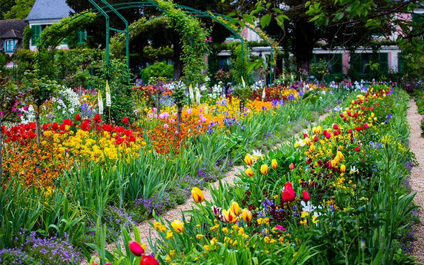

Impresionism was influenced by landscape painting and the effects of different shades of light on it. For example, certain shade of light could have been natural, from the clouds:

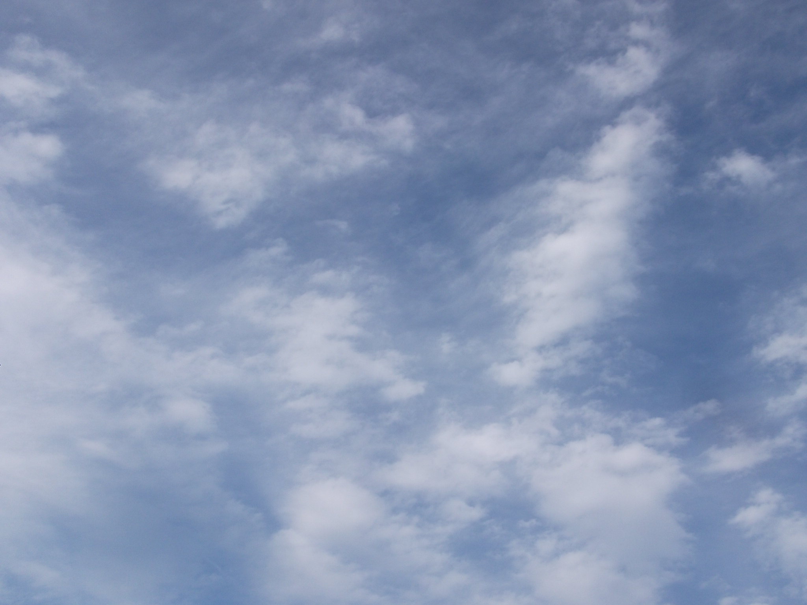

A neural-network using the neural-style architecture (and weights) produces, from these two real-life photographs above, and using the option `-original_colors 1` to try to preserve the colors in the content input image:

         th neural_style.lua -style_image real_photograph_morning_Clouds_wikipedia.jpg \
                             -content_image photo_Monet_Garden_at_Giverny.jpg \
                             -output_image Mix_photo_Monet_Garden_at_Giverny_real_photograph_morning_Clouds_wikipedia_original_colors.png \
                             -original_colors 1 \
                             -gpu -1

Result (there are other variations of the painting, with other tertiary qualities, saved during the iterations of the neural-style algorithm):

| Original Photo            |            | Obtained by neural-style network |
|:-------------------------:|------------|:--------------------------------:|
| 
  
 |            | 
 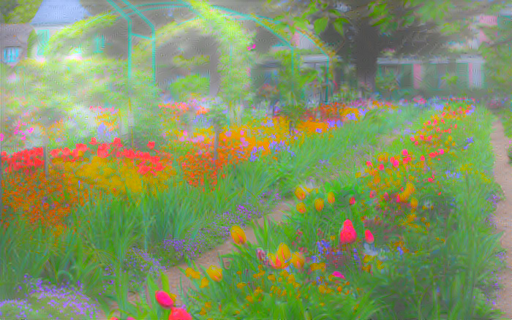 
 |

(Below are some of the paintings that Monet really painted of his garden in Giverny:

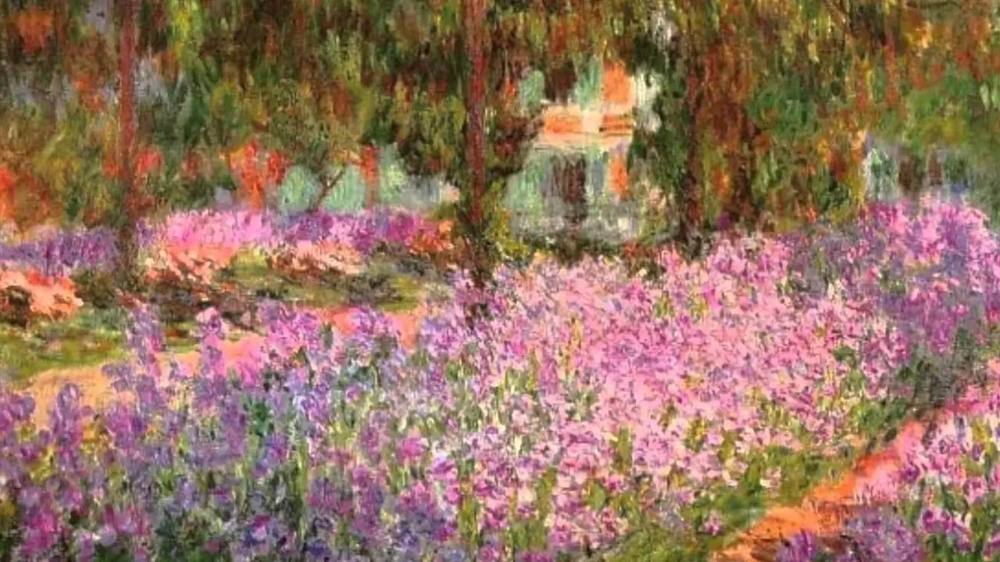
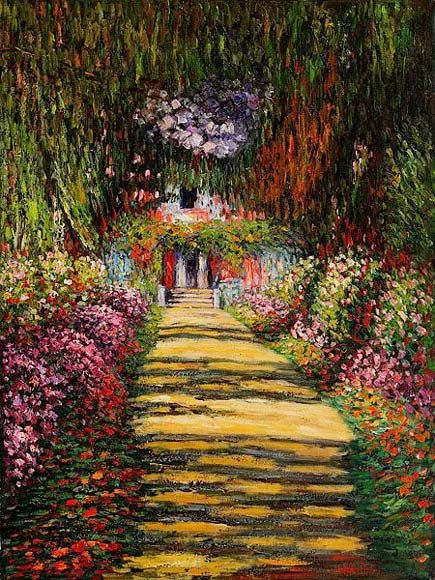

As an hypothesis, it seems as if Monet combined other techniques, as minor touches, into some of his paintings, like some form of [Michelangelo's Cangiantismo](http://www.webexhibits.org/colorart/michelangelo.html), perhaps.
)

* This is an example of applying a real photo as a background on a real-life photography as a content image in order to suggest tertiary qualities similar to those of Impressionism. [The content image photograph is at the Wikipedia Online Encyclopedia at [https://commons.wikimedia.org/wiki/File:Umbrellas_in_Dulcimer_Grove_at_the_Philadelphia_Folk_Festival_(7825184688).jpg]([https://commons.wikimedia.org/wiki/File:Umbrellas_in_Dulcimer_Grove_at_the_Philadelphia_Folk_Festival_(7825184688).jpg)

by:

         th neural_style.lua -style_image real_photograph_morning_Clouds_wikipedia.jpg \
                             -content_image photo_Umbrellas_in_Dulcimer_Grove_at_the_Philadelphia_Folk_Festival.jpg \
                             -output_image Mix_Umbrellas_in_Dulcimer_Grove_at_the_Philadelphia_Folk_Festival.png \
                             -original_colors 1 \
                             -gpu -1

the neural network produces a painting with some Impressionist tertiary qualities:

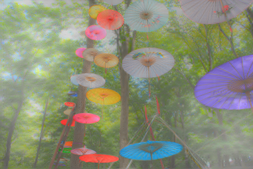

* Another example of applying a real photo as a background on a real-life photography as a content image in order to suggest tertiary qualities similar to those of Impressionism. (The content image photograph is at the Wikipedia Online Encyclopedia at [https://commons.wikimedia.org/wiki/File:Moraine_State_Park_Hot_air_balloons.jpg]](https://commons.wikimedia.org/wiki/File:Moraine_State_Park_Hot_air_balloons.jpg), and the background image is at the Wikipedia Online Encyclopedia at [https://upload.wikimedia.org/wikipedia/commons/4/40/Polar_Stratospheric_Cloud_type_I_above_Cirrus.jpg](https://upload.wikimedia.org/wikipedia/commons/4/40/Polar_Stratospheric_Cloud_type_I_above_Cirrus.jpg).)

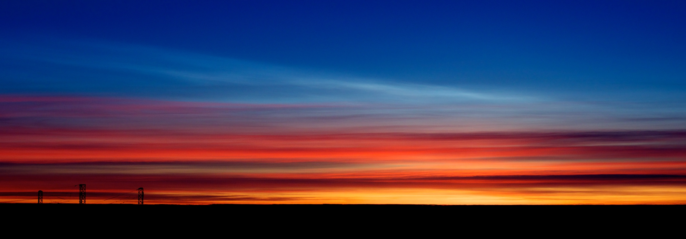

the neural-style network, when run with the option `-style_weight 150`, generated some paintings, the final of which was:

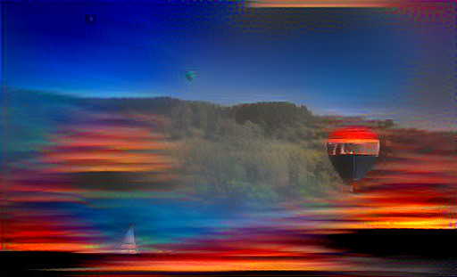

* This is an example of applying a background on a real-life photography in order to obtain tertiary qualities similar to one's of Claude Monet's in his Cathedral of Rouen series:

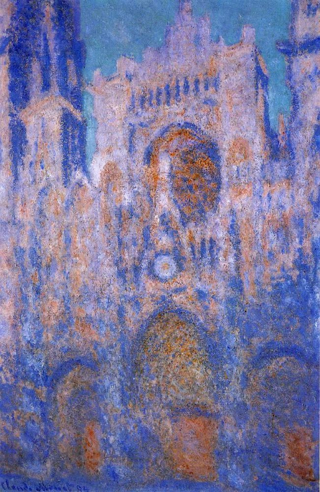

Applying the background in the left to the real-life photography of the Chrysler building, in the right:

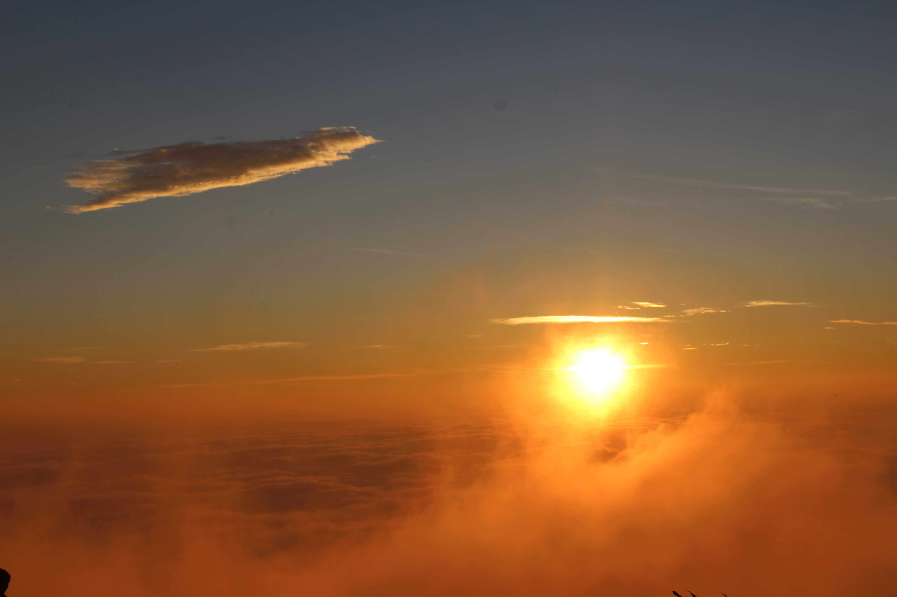
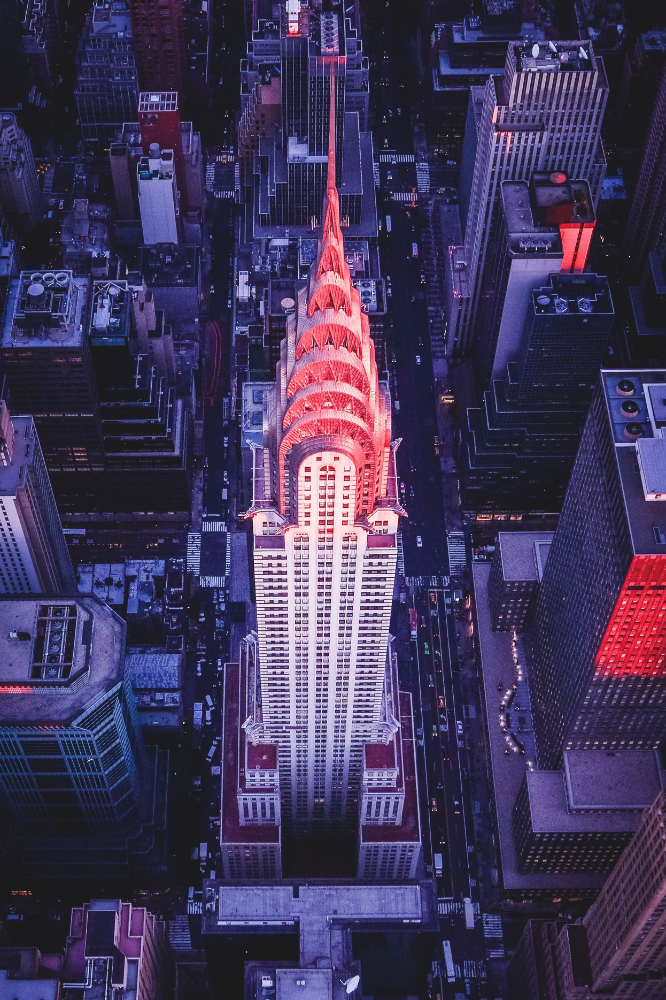

by:

         th neural_style.lua -style_image background_sunrise.jpg \
                             -content_image photo_Chrysler_Building.jpg \
                             -output_image Mix_photo_Chrysler_Building_background_sunrise.png \
                             -original_colors 1 \
                             -gpu -1

the neural network gives a hint of how it could be a painting of the Chrysler building with some tertiary qualities in Claude Monet's Cathedral of Rouen:

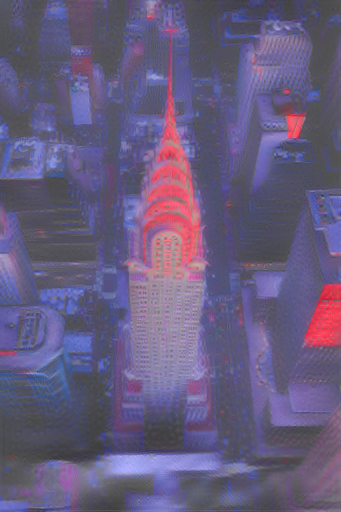

* This is a similar example, again on Claude Monet's in his Cathedral of Rouen series:

Applying the background in the left to the real-life photography of the town of Hallstatt, Austria, in the right:

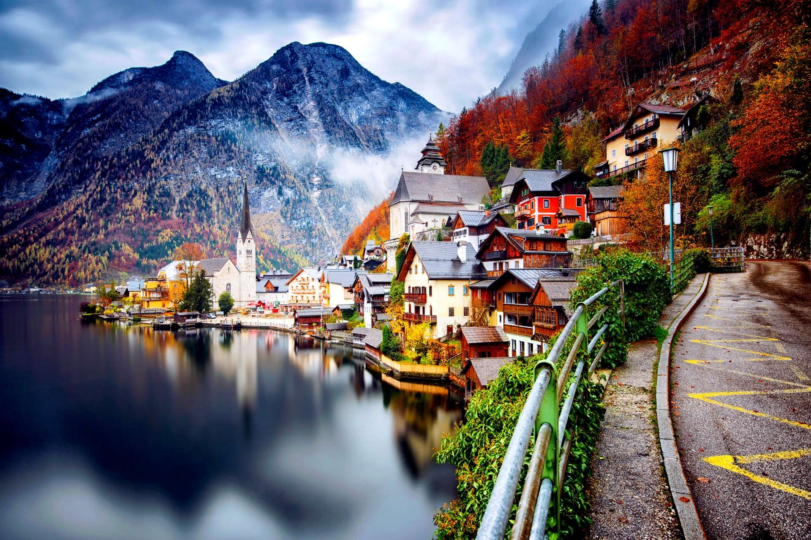

by:

         th neural_style.lua -style_image background_sunrise.jpg \
                             -content_image photo_Hallstatt_Austria.jpg \
                             -output_image Mix_photo_Hallstatt_Austria_background_sunrise.png \
                             -original_colors 1 \
                             -gpu -1

the neural network gives a hint of some tertiary qualities like in Claude Monet's Cathedral of Rouen:

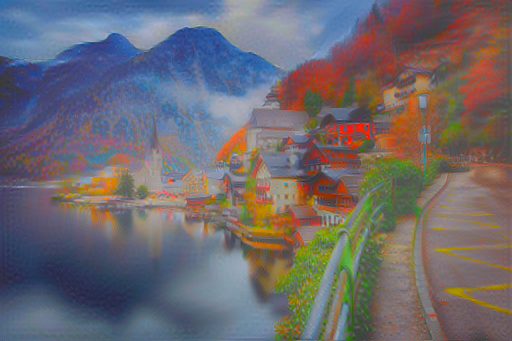

* Titian's "Pastoral Concert" as content-image with fountain riples as style image:

         th neural_style.lua -style_image Fountain_ripples.jpg \
                             -content_image  Titian_Pastoral_Concert.jpg \
                             -output_image Mix_Titian_Pastoral_Concert_Fountain_ripples.png \
                             -gpu -1

Result:

* Giovanni Bellini, Titian, and Dosso Dossi's "The Feast of the Gods" as content-image with a photograph of the HEP FIVE Ferris Wheel at Osaka as style image:

         th neural_style.lua -style_image background_HEP_Five_Ferris_Wheel.jpg \
                             -content_image  Titian_Giovanni_Bellini_The_Feast_of_the_Gods.jpg \
                             -output_image Mix_Titian_Giovanni_Bellini_The_Feast_of_the_Gods_HEP_Five_Ferris_Wheel.png \
                             -gpu -1

Result:

To decrease the effect above of the red color on the content image, you might use, among other ways, the option `-content_weight W` to increase the relative weight of the content image for the neural network (the implicit, current default for `-content_weight` is 5). E.g., for `-content_weight 80`, it results:

or you might decrease the relative weight of the style image for the neural network with the option `-style_weight W` (the implicit, current default for `-style_weight` is 100). E.g., for `-style_weight 6.25`, it results:

* Boticelli's Primavera as content-image with a real-life photograph of the Avenue of Live Oaks at Boone Hall in Mount Pleasant, South Carolina (planted in 1743) as style image:

         th neural_style.lua -style_image background_Avenue_Oaks_Boone_Hall_Mount_Pleasant_South_Carolina.jpg \
                             -content_image Boticelli_Primavera.jpg \
                             -output_image Mix_Boticelli_Avenue_Oaks_Boone_Hall.png \
                             -gpu -1

Result:

As always, you may add other parameters to the neural-style processing as to hint for other tertiary qualities in both images. E.g., adding the parameter `-content_weight 90` (its implicit default value is 5) to the command-line in this example, we obtain:

* Boticelli's Primavera as content-image with Monet's "Spring in Giverny" (1890) as style image:

         th neural_style.lua -style_image background_Claude_Monet_Spring_in_Giverny_1890.jpg \
                             -content_image Boticelli_Primavera.jpg \
                             -output_image Mix_Boticelli_Claude_Monet_Spring_in_Giverny_1890.png \
                             -gpu -1

Result:

* Ford Madox Brown's "An English Autumn Afternoon" as content-image with Monet's "Spring in Giverny" (1890) as style image:

         th neural_style.lua -style_image background_Claude_Monet_Spring_in_Giverny_1890.jpg \
                             -content_image Ford_Madox_Brown_An_English_Autumn_Afternoon.jpg \
                             -output_image Mix_Ford_Madox_Brown_An_English_Autumn_Afternoon_Monet_Spring_in_Giverny_1890.png \
                             -gpu -1

Result:

* Ford Madox Brown's "An English Autumn Afternoon" as content-image with Monet's "Poppy Field near Giverny" as style image:

         th neural_style.lua -style_image background_Claude_Monet_Poppy_Field_near_Giverny.jpg \
                             -content_image Ford_Madox_Brown_An_English_Autumn_Afternoon.jpg \
                             -output_image Mix_Ford_Madox_Brown_An_English_Autumn_Afternoon_Monet_Poppy_Field_near_Giverny.png \
                             -gpu -1

Result:

* As an example of applying a weighted sequence of style images to an input content image, it appears below Boticelli's Primavera as content image, and style-images the weighted sequence of a photography of Algonquin Provincial Park, the Avenue of Live Oaks at Boone Hall (S.C.), and the Monet's painting "Spring in Giverny" (1890), in that order, with relative weights 10, 10 and 15 among the three, respectively:

         th neural_style.lua \
              -style_image Autumn_in_Algonquin_Park.jpg,background_Boone_Hall_Mt_Pleasant_South_Carolina.jpg,background_Claude_Monet_Spring_in_Giverny_1890.jpg \
              -style_blend_weights 10,10,15 \
              -content_image Boticelli_Primavera.jpg \
              -output_image Mix_Boticelli_Algonquin_Park_Boone_Hall_SC_Monet_Spring_in_Giverny.png \
              -gpu -1

Result:

Notice in this example that the option `-save_iter <#-iters>`, to save the transformed image after `<#-iters>` iterations (default: 100), is very useful, since it writes versions of the image (through the ConvNet iterations) which may have artistic value by themselves. For example, this one in iteration 300:

